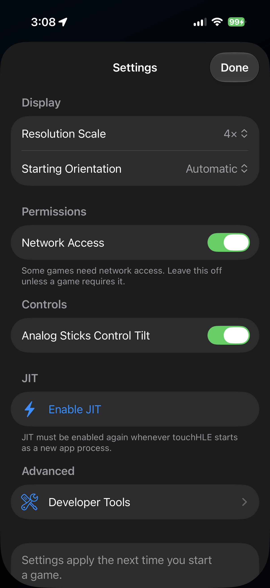
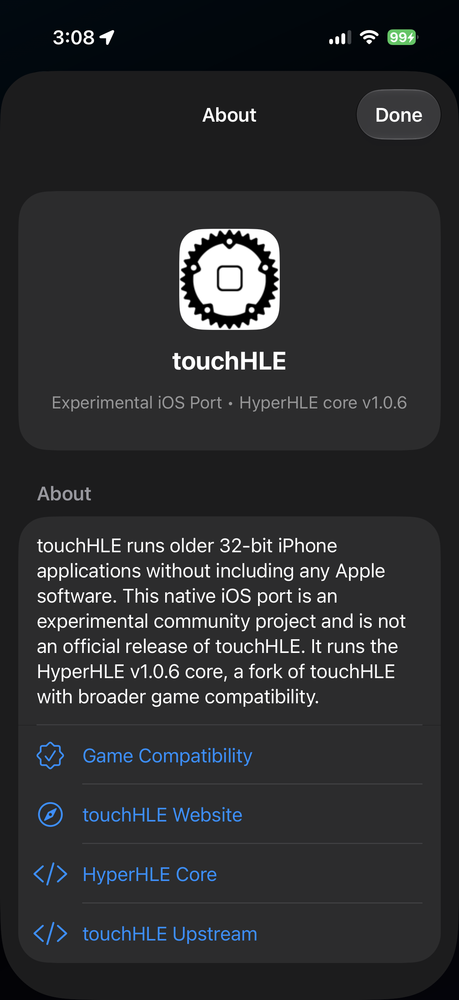

# touchHLE for iOS (Unofficial)

An experimental iOS port of [touchHLE](https://touchhle.org/) that plays supported
32-bit iPhone games on modern iPhones — **no jailbreak required**, though JIT is.

**One app, two emulator cores.** They support different sets of games, so both
ship inside the app and you choose which one runs each game:

| Core | Version | |
| --- | --- | --- |
| **HyperHLE** | [v1.0.6](https://github.com/HyperHLE/HyperHLE) | Runs more games, including The Sims Medieval |
| **touchHLE** | 0.2.3 | The original emulator |

Neither is strictly better. Set the default in Settings, or touch and hold a game
in your library to give that game its own core. Before 0.3.0 the two cores shipped
as two separate apps; 0.3.0 replaces the HyperHLE one, and the old touchHLE 0.1.0
app can be deleted once you have it.

This is **not** an official release of touchHLE or of HyperHLE, and neither project
endorses it. The emulator core is their work; this repository adds the native iOS
host app, its build system and packaging. No games or Apple software are included.

| | |
| --- | --- |
| Latest build | 0.3.0 |
| Emulator cores | HyperHLE v1.0.6 and touchHLE 0.2.3, switchable per game |
| Minimum iOS | 17.4 |
| Tested on | iPhone 16 Pro, iOS 27 beta 4 (24A5390f) |
| JIT | Required each time the app starts as a new process |
| Games | Not included — bring your own decrypted 32-bit IPA |

## Screenshots

| Library | Settings | About |
| --- | --- | --- |
|  |  |  |

Games shown are not included and must be supplied by you.

## Install

Download `touchHLE-HyperHLE-iOS-unsigned.ipa` from the
[latest release](https://github.com/johnny901901901/touchHLE-for-iOS/releases) and sideload
it with AltStore Classic, or build and sign it yourself in Xcode. Then enable JIT
with [StikDebug](https://github.com/StephenDev0/StikDebug) + LocalDevVPN, or AltJIT.

**[Full install, JIT, import and troubleshooting guide →](platform/ios/README.md)**

A free Apple account works, with Apple's usual seven-day signing limit. A paid
developer account signs for longer but does not remove the JIT requirement.

## What works

Tested in the **HyperHLE 0.2.0** build on an iPhone 16 Pro running iOS 27 beta 4
(build 24A5390f). Exact app versions matter — the same game can behave very
differently between releases, and between the two cores:

| Game | Version | Status |
| --- | --- | --- |
| Flappy Bird | 1.1.0 | Playable, including at 2x–4x resolution scale |
| Touch & Go | 1.1 | Playable at all resolution settings |
| Tony Hawk's Pro Skater 2 | 1.2.1 | Playable |
| Wolfenstein RPG | 1.1.1 | Playable |
| Mirror's Edge | 1.4.72 | Playable |
| The Sims Medieval | 1.0.1 | Playable, but see below |

Only one device has been tested, and only on an iOS **beta**. No shipping iOS
release has been verified yet, so reports from stable iOS 17.4+ are especially
useful.

## Known issues

- **The Sims Medieval:** no keyboard appears when naming your Sim or your kingdom,
  so those names cannot be entered. The game is still playable past those screens —
  the confirm control sits near the top-right corner rather than where it is drawn.
- JIT is required; there is no interpreter fallback.
- Games rendering through an offscreen texture gain no extra detail from resolution
  scaling, which is applied only where it is safe to do so.
- A high rating in the [compatibility database](https://appdb.touchhle.org/)
  describes touchHLE generally and does not guarantee behaviour through this port.
- Some games run under one core and not the other. Call of Duty: Zombies has been
  reported working under touchHLE 0.2.3 but not under HyperHLE. If a game fails,
  switch its core and try again before reporting it.

## Reporting a game

[Open an issue](https://github.com/johnny901901901/touchHLE-for-iOS/issues/new/choose) using
the compatibility report form. Please include the exact app version, your iPhone
model and iOS version, whether JIT was enabled, the port version, and a log excerpt
(`touchHLE_log.txt`, reachable in Files under *On My iPhone → touchHLE*).

**Do not post IPA files or links to them, pairing files, signing certificates,
provisioning profiles or device backups.**

## Building

See [platform/ios/README.md](platform/ios/README.md#build-from-source). In short:

```sh
git clone --recurse-submodules https://github.com/johnny901901901/touchHLE-for-iOS.git
cd touchHLE-for-iOS
sh platform/ios/scripts/build-sdl-shared.sh iphoneos
sh platform/ios/scripts/build-host.sh iphoneos Release
```

That builds an app carrying the HyperHLE core alone. For the touchHLE core as
well, check out [`johnny901901901/touchHLE`](https://github.com/johnny901901901/touchHLE)
at branch `ios-core-dylib` beside it and point the build at it:

```sh
TOUCHHLE_CORE_REPO=../touchHLE sh platform/ios/scripts/build-host.sh iphoneos Release
```

The app ships whichever cores were built; the picker appears only when there is
more than one.

`vendor/dynarmic` points at a fork carrying the changes needed to run the arm64 JIT
inside a signed iOS app (MAP_JIT / W^X handling), so the `--recurse-submodules` part
matters.

## Credits

- [touchHLE](https://github.com/touchHLE/touchHLE) — the original emulator, and the
  work this rests on entirely.
- [HyperHLE](https://github.com/HyperHLE/HyperHLE) — the compatibility fork used as
  this build's core.
- [u/WorriedEquipment2241](https://www.reddit.com/user/WorriedEquipment2241/) for
  publicly demonstrating a separate touchHLE iOS experiment on a jailbroken device,
  which helped show the direction was worth pursuing.

Licensed under MPL-2.0, subject to the existing third-party licence requirements.
Neither upstream project endorses this build.
